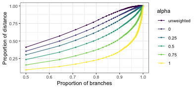
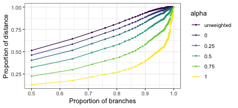

# Code to make the figures

```r
library(knitr)
opts_chunk$set(cache=TRUE, cache.path = "figures-cache/",
    fig.path = "figures/", dev=c("png"),
    fig.width = 5, fig.height = 3)
```


```r
library(phyloseq)
library(ape)
library(igraph)
library(ggnetwork)
library(viridis)
library(ade4)
library(Matrix)
library(cluster)
library(DistatisR)
library(parallel)
library(foreach)
library(tidyverse)
library(magrittr)
library(gg3D)
library(plyr)
source("tree_breaking_functions.R")
load("phyloseq_objects.RData")
```


## Unifrac equivalent trees
Here we're splitting up the tree into pieces

```r
broken_tree = break_tree(phy_tree(abt), t(otu_table(abt)))
## the number of trees in the forest
leaf_sizes = get_leaf_sizes(broken_tree)
leaf_sizes %>% group_by(n_leaves) %>% dplyr::summarise(n_trees = n())
```

```
## # A tibble: 42 x 2
##    n_leaves n_trees
##       <int>   <int>
##  1        1      49
##  2        2      18
##  3        3       6
##  4        4       9
##  5        5       5
##  6        6       3
##  7        7       2
##  8        8       6
##  9        9       3
## 10       10       3
## # … with 32 more rows
```

```r
ggplot(leaf_sizes %>% group_by(n_leaves) %>% dplyr::summarise(n_trees = n())) +
    geom_segment(aes(x = n_leaves, y = n_trees, xend = n_leaves, yend = 0)) +
    geom_hline(aes(yintercept = 0), color = "gray") +
    scale_x_log10("Number of leaves",
                  breaks = c(1:10, 13, 17, 20, 25, 30, 40, 59, 75, 102, 168, 199, 362)) +
    scale_y_continuous("Number of trees") +
    theme(panel.grid.major.x = element_blank(),
          panel.grid.minor.x = element_blank(),
          panel.grid.minor.y = element_blank(),
          panel.grid.major.y = element_blank(),
          axis.text.x = element_text(size = 7),
          axis.title.x = element_text(size = 9),
          axis.title.y = element_text(size = 9))
```


We might also be interested in what the relationship is between the
relative abundances of OTUs in a subtree and the size of that
subtree. We investigate here:

```r
leaf_list = get_leaf_list(broken_tree)
subtree_ab = ldply(leaf_list, function(x) {
    c("mean_ab" = mean(otu_table(abt_log)[x,]),
      "n_leaves" = length(x))
}, .id = "tree_id")
ggplot(subtree_ab) +
    geom_point(aes(x = n_leaves, y = mean_ab)) +
    scale_x_log10() +
    ylab("Average log-transformed abundance of subtree")
```


## Branch Decomposition


```r
alpha_list = list("unweighted", 0, .25, .5, .75, 1)
contrib_matrix = get_all_branch_contribs(
    X = t(as(otu_table(abt_log), "matrix")),
    tr = phy_tree(abt_log),
    alpha_list = alpha_list)
```

Accumulation plot:


```r
contrib_accumulation_plot_old(contrib_matrix, phy_tree(abt_log), unlist(alpha_list))  +
        geom_point(size=.5) + geom_line() +
        scale_x_log10(breaks = c(2, 5, 10, 25, 50, 100, 250, 500, 1000, 2500)) +
        xlab("Number of descendants") + ylab("Proportion of distance") + labs(color = "alpha")
```


```r
contrib_accumulation_plot(contrib_matrix, phy_tree(abt_log), unlist(alpha_list))  +
        geom_point(size=.5) + geom_line() +
        xlab("Proportion of branches") + ylab("Proportion of distance") + labs(color = "alpha")
```




Plotting contributions along the tree:


```r
edgeMapping = data.frame(phy_tree(abt_log)$edge,
   t(contrib_matrix), desc = get_ndescendants(phy_tree(abt_log)))
colnames(edgeMapping)[1:2] = c("parentNode", "childNode")
edgeMapping$parentNodeName = as.character(edgeMapping$parentNode)
edgeMapping$childNodeName = as.character(edgeMapping$childNode)

## decide what tips to drop
set.seed(0)
tips.to.drop = sample(ntaxa(abt_log), size = 2500)
## add node/tip labels to the tree so that we can recover the mappings
## to the original tree
n = length(phy_tree(abt_log)$tip.label)
m = length(phy_tree(abt_log)$node.label)
tr = phy_tree(abt_log)
tr$node.label = (n+1):(n + m)
tr$tip.label = 1:n
## the subtree
tr_subsampled = my.drop.tip(tr, tip = tips.to.drop)

treeplot = my_plot_tree(tr_subsampled)
treeplot$segmentDF$parentNodeName =
    c(tr_subsampled$tip.label, tr_subsampled$node.label)[treeplot$segmentDF$parentNode]
treeplot$segmentDF$childNodeName =
    c(tr_subsampled$tip.label, tr_subsampled$node.label)[treeplot$segmentDF$childNode]
tree_and_covariates = merge(treeplot$segmentDF, edgeMapping,
    by.x = c("parentNodeName", "childNodeName"),
    by.y = c("parentNodeName", "childNodeName"))

ggplot(tree_and_covariates) +
    geom_segment(aes(x = x, y = y, xend = xend, yend = yend),
                 data = subset(treeplot$segmentDF, type == "horizontal"),
                 color = "lightgray", size = 1) + 
    geom_segment(aes(x = x, y = y, xend = xend, yend = yend, color = log10(X1.1)),
                 size = 1) +
    scale_color_viridis(na.value = viridis(2, begin = 0, end = 1)[1], "Contribution") +
        tree_theme
```


```r
ggplot(tree_and_covariates) +
    geom_segment(aes(x = x, y = y, xend = xend, yend = yend),
                 data = subset(treeplot$segmentDF, type == "horizontal"),
                 color = "lightgray", size = 1) + 
    geom_segment(aes(x = x, y = y, xend = xend, yend = yend, color = log10(X6)),
                 size = 1) +
    scale_color_viridis(na.value = viridis(2, begin = 0, end = 1)[1], "Contribution") +
    tree_theme
```


Compute unnormalized branch contributions (for a full branches, not per unit branch).


```r
contrib_matrix_unnormalized = get_all_branch_contribs(
    X = t(as(otu_table(abt_log), "matrix")),
    tr = phy_tree(abt_log),
    alpha_list = alpha_list, per_unit_branch = FALSE)
```


```r
contrib_accumulation_plot(contrib_matrix_unnormalized, phy_tree(abt_log), unlist(alpha_list))  +
        geom_point(size=.5) + geom_line() +
        xlab("Proportion of branches") + ylab("Proportion of distance") + labs(color = "alpha")
```



## Glomming

First glom the tips together.


```r
kvec = c(2582, 1024, 512, 256, 128, 64, 32, 16)
glommedListAbt = makeGlommedList(abt_log, kvec)
```


```r
guf_glomming_params = list("bray", "unweighted", 0, .1, .5, .9, 1)
glom.rv.abt = plyr::ldply(guf_glomming_params, function(param) {
    if(param == "bray") {
        gd = makeGlommingDistances(glommedListAbt, kvec, d = "bray")
    } else if(param == "unweighted") {
        gd = makeGlommingDistances(glommedListAbt, kvec, d = "unifrac")
    } else if(is.numeric(param)) {
        gd = makeGlommingDistancesGUF(glommedListAbt, kvec, param)
    }
    return(data.frame(rv = gd$res4Cmat$C[,1],
                      ntaxa = kvec,
                      distance = param))
})
```


```r
glom.rv.abt$distance = factor(glom.rv.abt$distance, levels = unlist(guf_glomming_params), ordered = TRUE)
abt.glomming.guf.plot = ggplot(subset(glom.rv.abt, distance != "bray")) +
    geom_line(aes(y = rv, x = ntaxa, color = distance)) +
    scale_x_log10(breaks = kvec) +
    theme(panel.grid.minor.x = element_blank()) +
    xlab("Number of taxa") + labs(color = "alpha") +
    theme(legend.key.size = unit(.4, "cm")) +
    scale_y_continuous("RV coefficient", limits = c(.4, 1.01), breaks = seq(.5, 1, by = .1))
```


```r
dpcoa_r_vec = seq(0, 1, length.out = 11)
glom.rv.abt.dpcoa = plyr::ldply(dpcoa_r_vec, function(r) {
    gd = makeGlommingDistancesDPCoA(glommedListAbt, kvec, r)
    return(data.frame(rv = gd$res4Cmat$C[,1],
           ntaxa = kvec,
           r = r))
})
glom.rv.abt.dpcoa$r = factor(glom.rv.abt.dpcoa$r, levels = dpcoa_r_vec, ordered = TRUE)
```

```r
abt.glomming.dpcoa.plot = ggplot(glom.rv.abt.dpcoa) +
    geom_line(aes(y = rv, x = ntaxa, color = r)) +
    scale_x_log10(breaks = kvec) +
    theme(panel.grid.minor.x = element_blank()) +
    xlab("Number of taxa") +
    scale_y_continuous("RV coefficient", limits = c(.4, 1.01), breaks = seq(.5, 1, by = .1)) +
    theme(legend.key.size = unit(.4, "cm")) + labs(color = "r")
```


```r
library(gridExtra)
g_legend<-function(a.gplot){
  tmp <- ggplot_gtable(ggplot_build(a.gplot))
  leg <- which(sapply(tmp$grobs, function(x) x$name) == "guide-box")
  legend <- tmp$grobs[[leg]]
  return(legend)
}
grid.arrange(abt.glomming.dpcoa.plot + theme(legend.position = "none"),
             g_legend(abt.glomming.dpcoa.plot),
             abt.glomming.guf.plot + theme(legend.position = "none"),
             g_legend(abt.glomming.guf.plot),
             ncol = 2, widths = c(1, .3))
```


## MDS plot describing relationships between all the distances


```r
guf_alpha_vec = c(0, .1, .25, .5, .75, .9, 1)
dpcoa_r_vec = seq(0, 1, length.out = 11)
distance_types = data.frame(
    family = c("unweighted", rep("Unifrac", length(guf_alpha_vec)), rep("DPCoA", length(dpcoa_r_vec)), "bray", "jaccard"),
    param = c(NA, guf_alpha_vec, dpcoa_r_vec, NA, NA))
## make all the distance matrices
distance_list = list()
for(i in 1:nrow(distance_types)) {
    family = distance_types[i,1]
    param = distance_types[i,2]
    if(family == "unweighted") {
        distance_list[[i]] = fastUniFrac(abt_log, weighted = FALSE)
    } else if(family == "Unifrac") {
        distance_list[[i]] = fastUniFrac(abt_log, weighted = TRUE, alpha = param)
    } else if(family == "DPCoA") {
        distance_list[[i]] = dpcoaDist(t(as(otu_table(abt_log), "matrix")), phy_tree(abt_log), r = param)
    } else if(family == "jaccard") {
        distance_list[[i]] = distance(abt_log, method = "bray")
    } else if(family == "bray") {
        distance_list[[i]] = distance(abt_log, method = "jaccard")
    }
}
```


```r
distance_array = array(dim = c(nsamples(abt_log), nsamples(abt_log), length(distance_list)))
for(i in 1:length(distance_list)) {
    distance_array[,,i] = as.matrix(distance_list[[i]])
}
out_distatis = distatis(distance_array)
```


```r
labs = sprintf("Axis %i: %4.2f%%", 1:length(distance_list),
    out_distatis$res4Cmat$eigValues / sum(out_distatis$res4Cmat$eigValues) * 100)
plotting = data.frame(distance_types, sweep(scale(out_distatis$res4Cmat$eigVector, center = TRUE), MARGIN = 2, STAT = sqrt(out_distatis$res4Cmat$eigValues), FUN = "*"))
plotting$dim.1 = -plotting$dim.1
p2d = ggplot(plotting) +
    geom_point(aes(x = dim.1, y = dim.2, shape = family, color = param)) +
    xlab(labs[1]) +  ylab(labs[2]) + labs(color = "Parameter:\nalpha or r", shape = "Distance\ntype") +
        scale_color_viridis() + guides(color = guide_legend(barwidth = 3))
theta = 35
phi = 0
p3d =
    ggplot(plotting, aes(x = dim.1, y = dim.2, z = dim.3, color = param, shape = family)) +
    labs_3D(labs=labs[1:3],theta = theta, phi = phi,
            hjust=c(-.1,.25,-.1), vjust=c(0, -1, 0), angle=c(0, 0, 0)) +
    labs(color = "Parameter:\nalpha or r", shape = "Distance\ntype") +
        axis_labs_3D(data = function(x) {
            ## this is to make the scales for the axes display correctly
            x$dim.1 = round(as.numeric(x$dim.1), digits = 2)
            x$dim.2 = round(as.numeric(x$dim.2), digits = 2)
            x$dim.3 = round(as.numeric(x$dim.3), digits = 2)
            return(x)
        }, size=2.3,theta = theta, phi = phi,hjust=c(0,1.2,0,2.1,1.27,1),vjust=c(1.5,1.8,1.5,1.5,1.5,2)) +
    axes_3D(theta = theta, phi = phi) + stat_3D(theta=theta, phi = phi) +
    scale_color_viridis() + theme_blank()
grid.arrange(p2d + theme(legend.position = "none"),
             g_legend(p2d),
             p3d + theme(legend.position = "none"),
             ncol = 2, widths = c(1, .3), layout_matrix = matrix(c(1,3,2,2), nrow = 2))
```


