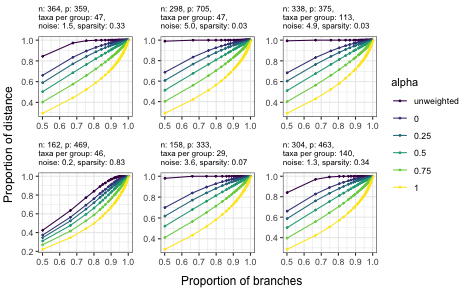
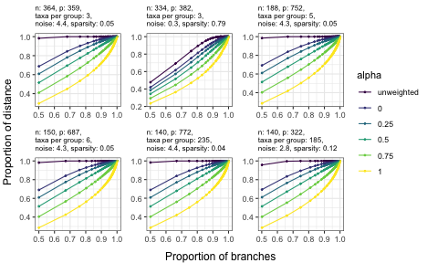
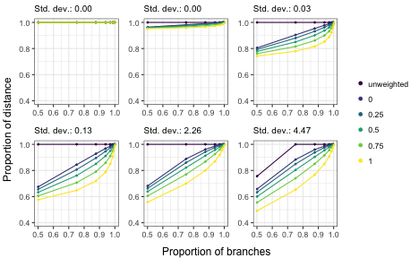

# Simulations


In this file, we give the code used for the simulated data.
We start off with some functions we need for the simulations and plotting.
The `getDescendants` function below is due to , and the `g_legend` function is from 


```r
getDescendants<-function(tree,node,curr=NULL){
  if(is.null(curr)) curr<-vector()
  daughters<-tree$edge[which(tree$edge[,1]==node),2]
  curr<-c(curr,daughters)
  w<-which(daughters>=length(tree$tip))
  if(length(w)>0) for(i in 1:length(w)) 
    curr<-getDescendants(tree,daughters[w[i]],curr)
  return(curr)
}
```


```r
library(rmutil)
library(ape)
library(gridExtra)
library(phytools)
source("tree_breaking_functions.R")
alpha_list = list("unweighted", 0, .25, .5, .75, 1)
g_legend <- function(a.gplot){
  tmp <- ggplot_gtable(ggplot_build(a.gplot))
  leg <- which(sapply(tmp$grobs, function(x) x$name) == "guide-box")
  legend <- tmp$grobs[[leg]]
  return(legend)
}
```

## Simulation 1


In simulation 1, the samples fall into two groups, each of which has its own set of characteristic taxa, and the sets are unrelated to the phylogeny.
We pick the number of samples $n$, the number of taxa $p$, the number of characteristic taxa in each group, and the mean value for the noise at random.
$n$ is chosen uniformly from even numbers between 40 and 400, $p$ is chosen uniformly for numbers between 200 and 800, and the number of taxa per group is chosen uniformly between 5 and $p/3$.
The noise is taken from a scaled and translated beta distribution: the mean of the noise is $5x + .1$, where $x$ has a $beta(.3,.3)$ distribution.
The parameters in the beta distribution were chosen so that we would preferentially get values close to the endpoints of the range of possible values, $.1$ and $5.1$.


```r
set.seed(0)
sim_1_plot_list = list()
for(sim in 1:6) {
    n = sample(20:200, size = 1) * 2
    p = sample(200:800, size = 1)
    n_taxa_per_group = sample(5:(p/3), size = 1)
    noise = rbeta(n = 1, shape1 = .3, shape2 = .3) * 5 + .1
    tree = rtree(p)
    group_one_taxa = sample(p, n_taxa_per_group)
    group_two_taxa = sample(p, n_taxa_per_group)
    sample_groups = c(rep(0, n/2), rep(1, n/2))
    mean = outer(sample_groups, 10 * ((1:p) %in% group_one_taxa) / sqrt(n_taxa_per_group)) +
        outer(1 - sample_groups, 10 * ((1:p) %in% group_two_taxa) / sqrt(n_taxa_per_group))
    noiseMean = matrix(rgamma(n * p, noise), ncol = p)
    X = apply(noiseMean + mean, 1:2, function(x) rpois(1, x))
    contrib_matrix = get_all_branch_contribs(
        X = log(1 + X),
        tr = tree,
        alpha_list = alpha_list)
    title = sprintf("n: %i, p: %i,\ntaxa per group: %i,\nnoise: %.1f, sparsity: %.2f",
        n, p, n_taxa_per_group, noise, mean(X == 0))
    cat(title, "\n")
    sim_1_plot_list[[sim]] =
        contrib_accumulation_plot(contrib_matrix, tree, unlist(alpha_list))  +
            geom_point(size=.5) + geom_line() +
            xlab("Proportion of branches") + ylab("Proportion of distance") +
            labs(color = "alpha", title = title)
}
```

```
## n: 364, p: 359,
## taxa per group: 47,
## noise: 1.5, sparsity: 0.33 
## n: 298, p: 705,
## taxa per group: 47,
## noise: 5.0, sparsity: 0.03 
## n: 338, p: 375,
## taxa per group: 113,
## noise: 4.9, sparsity: 0.03 
## n: 162, p: 469,
## taxa per group: 46,
## noise: 0.2, sparsity: 0.83 
## n: 158, p: 333,
## taxa per group: 29,
## noise: 3.6, sparsity: 0.07 
## n: 304, p: 463,
## taxa per group: 140,
## noise: 1.3, sparsity: 0.34
```


```r
sim_1_legend = g_legend(sim_1_plot_list[[1]])
sim_1_plot_list_no_legend = lapply(sim_1_plot_list,
    function(p) p + theme(legend.position = "none", axis.title = element_blank(), plot.title = element_text(size = 8)))
layout = matrix(c(1,4,2,5,3,6, rep(7,2)), nrow = 2)
grid.arrange(sim_1_plot_list_no_legend[[1]], sim_1_plot_list_no_legend[[2]],
             sim_1_plot_list_no_legend[[3]], sim_1_plot_list_no_legend[[4]],
             sim_1_plot_list_no_legend[[5]], sim_1_plot_list_no_legend[[6]],
             sim_1_legend, widths = c(1,1,1,.7), layout_matrix = layout,
             left = "Proportion of distance", bottom = "Proportion of branches")
```



## Simulation 2

In simulation 2, the samples fall along a gradient, with the endpoints corresponding to under- or over-representation of a certain clade.
We pick the number of samples $n$, the number of taxa $p$, clade associated with the gradient, and the mean value for the noise at random.
$n$ is chosen uniformly from even numbers between 40 and 400 and $p$ is chosen uniformly for numbers between 200 and 800.
To obtain the clade associated with the gradient, one of the interior nodes in the tree is sampled uniformly at random, and all the descendants of that node are the taxa associated with the gradient.
The noise is again taken from a scaled and translated beta distribution: the mean of the noise is $5x + .1$, where $x$ has a $beta(.3,.3)$ distribution.


```r
set.seed(0)
sim_2_plot_list = list()
for(sim in 1:6) {
    n = sample(20:200, size = 1) * 2
    p = sample(200:800, size = 1)
    noise = rbeta(n = 1, shape1 = .3, shape2 = .3) * 5 + .1
    tree = rtree(p)
    nodes = ((p+1):(2 * p - 1))
    clade = getDescendants(tree, sample(nodes, size = 1))
    tips = clade[clade <= p]
    loadings = 10 * ((1:p) %in% tips) / sqrt(length(tips))
    scores = runif(n)
    mean = outer(scores, loadings)
    noiseMean = matrix(rgamma(n * p, noise), ncol = p)
    X = apply(noiseMean + mean, 1:2, function(x) rpois(1, x))
    contrib_matrix = get_all_branch_contribs(
        X = log(1 + X),
        tr = tree,
        alpha_list = alpha_list)
    title = sprintf("n: %i, p: %i,\ntaxa per group: %i,\nnoise: %.1f, sparsity: %.2f",
        n, p, length(tips), noise, mean(X == 0))
    cat(title, "\n")
    sim_2_plot_list[[sim]] =
        contrib_accumulation_plot(contrib_matrix, tree, unlist(alpha_list))  +
            geom_point(size=.5) + geom_line() +
            xlab("Proportion of branches") + ylab("Proportion of distance") +
            labs(color = "alpha", title = title)
}
```

```
## n: 364, p: 359,
## taxa per group: 3,
## noise: 4.4, sparsity: 0.05 
## n: 334, p: 382,
## taxa per group: 3,
## noise: 0.3, sparsity: 0.79 
## n: 188, p: 752,
## taxa per group: 5,
## noise: 4.3, sparsity: 0.05 
## n: 150, p: 687,
## taxa per group: 6,
## noise: 4.3, sparsity: 0.05 
## n: 140, p: 772,
## taxa per group: 235,
## noise: 4.4, sparsity: 0.04 
## n: 140, p: 322,
## taxa per group: 185,
## noise: 2.8, sparsity: 0.12
```

Finally, we plot the branch accumulation curves for each simulated data set.


```r
sim_2_legend = g_legend(sim_2_plot_list[[1]])
sim_2_plot_list_no_legend = lapply(sim_2_plot_list,
    function(p) p + theme(legend.position = "none", axis.title = element_blank(), plot.title = element_text(size = 8)))
layout = matrix(c(1,4,2,5,3,6, rep(7,2)), nrow = 2)
grid.arrange(sim_2_plot_list_no_legend[[1]], sim_2_plot_list_no_legend[[2]],
             sim_2_plot_list_no_legend[[3]], sim_2_plot_list_no_legend[[4]],
             sim_2_plot_list_no_legend[[5]], sim_2_plot_list_no_legend[[6]],
             sim_2_legend, widths = c(1,1,1,.7), layout_matrix = layout,
             left = "Proportion of distance", bottom = "Proportion of branches")
```




## Simulation 3 


In this simulation, the phylogeny is structured as a full binary tree, that is, a tree in which each node has two children, and the tree is taken to have all branches of the same length.
The samples are divided into two groups, and for any pair of leaves that share a parent, one leaf is present in the first group and absent in the second, and the other leaf is present in second group and absent in group the first.
If $i$ and $j$ are such that taxon $j$ is present in sample $i$, we take the corresponding element of the "observed" taxon abundance matrix $X_{ij}$ to sampled from a double Poisson distribution with mean 10 and a dispersion parameter of either 200, 150, 100, 2, or .5, depending on the simulation.
We also compute branch contributions in the noiseless case.
Here we have 512 species, 100 samples, mean count when a taxon is present in a sample is 10.


```r
p = 512
n = 100
nonzero_mean = 10
tree = stree(n = p, type = "balanced")
tree$edge.length = rep(1, nrow(tree$edge))
scores = c(rep(1, n/2), rep(-1, n/2))
loadings = rep(c(-1, 1), p/2)
presence_absence = outer(scores, loadings) + 1
```

Simulate counts using the double Poisson distribution.

```r
overdispersions = c(Inf, 200, 150, 100, 2, .5)
contrib_matrices = list()
for(i in seq_along(overdispersions)) {
    if(overdispersions[i] == Inf) {
        X = presence_absence
    } else {
        X = apply(presence_absence, 1:2, function(x) {
            if(x == 0) return(0)
            return(rdoublepois(n = 1, m = nonzero_mean, s = overdispersions[i]))
        })
    }
    contrib_matrices[[i]] =
        get_all_branch_contribs(X = log(1 + X), tr = tree, alpha_list = alpha_list)
}
```

The variance for the double Poisson family is approximately $\lambda / s$, where $\lambda$ is the mean and $s$ is the overdispersion parameter.
However, it seems that the approximation isn't very accurate when $s$ is very large, so we approximate the variances by Monte Carlo.

```r
dp_vars = sapply(overdispersions, function(s) {
    if(s == Inf) return(0)
    var(rdoublepois(n = 10000, m = nonzero_mean, s = s))
})
```


Finally, we make the plot of the branch contributions in the simulations.


```r
contrib_plots = lapply(seq_along(contrib_matrices), function(i) {
    cm = contrib_matrices[[i]]
    dp_var = dp_vars[i]
    contrib_accumulation_plot(cm, tree, unlist(alpha_list))  +
        geom_point(size=.5) + geom_line() +
        ylim(c(.4,1)) + theme(legend.position = "none", axis.title = element_blank(), plot.title = element_text(size = 10)) +
        labs(color = "alpha", title = sprintf("Std. dev.: %.2f", sqrt(dp_var)))
})

legend = g_legend(contrib_accumulation_plot(contrib_matrices[[1]], tree, unlist(alpha_list)) +
                      geom_point() + theme(legend.title = element_blank()))
layout = matrix(c(1,4,2,5,3,6, rep(7,2)), nrow = 2)
grid.arrange(contrib_plots[[1]], contrib_plots[[2]], contrib_plots[[3]],
             contrib_plots[[4]], contrib_plots[[5]], contrib_plots[[6]],
             legend, widths = c(1,1,1,.7), layout_matrix = layout,
             left = "Proportion of distance", bottom = "Proportion of branches")
```



